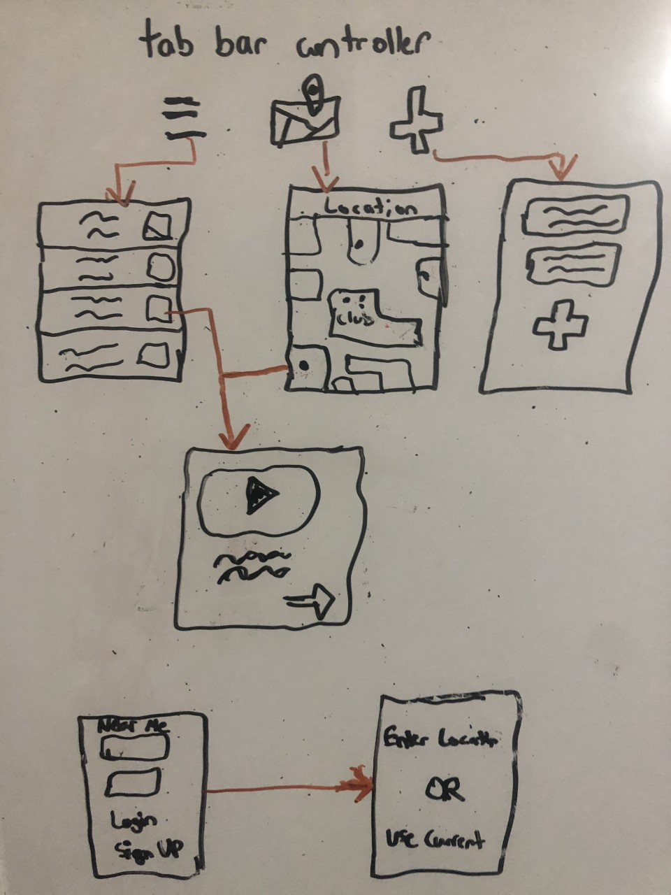

# NearMe

## Table of Contents
1. [Overview](#Overview)
1. [Product Spec](#Product-Spec)
1. [Wireframes](#Wireframes)
2. [Schema](#Schema)

## Overview
### Description
NearMe allows users to view short descriptions of events near them along with short videos from users at the events. Can be viewed on a list or map showing whats near you. Users can also post information about events currently happening, with the location, short description, and short video.

### App Evaluation
[Evaluation of your app across the following attributes]
- **Category:** Social/Video
- **Mobile:** View Only, uses camera, intended for mobile only experience
- **Story:** Allows users to find events near them and view short videos of whats currently going on.
- **Market:** Anyone looking for something to do or to go to near them could find use for this app. Can only find specific content from people you know through following. 
- **Habit:** Users can very easily check what's going on near them with a visual guide, and short stories make consumption easy since. Habit forming because users will be interested/curious on whats happening around them.
- **Scope:** Start out only focused on realtime events going on nearby. Can expand to following specific users.

## Product Spec

### 1. User Stories (Required and Optional)

**Required Must-have Stories**

* User can create a new account
* User can logins
* User can choose btwn input location, or use curr location
* User can post short info for local event w/ short desc, location, short vid,
* User can view map of local and recent (x HOURS) posts
* User can view list of local and recent posts

**Optional Nice-to-have Stories**

* Group together posts in same area for nicer map UI
*  Notification if area near seems active
*  User can change recent hour time frame
* User can only post vid for post after X time
* User can remove post
* User can follow/unfollow AND view feed based off followers' post
* User profiles more complex, profile pics, short desc

### 2. Screen Archetypes

* Login Screen/ Registration Screen
   * User can login/create new acct
* Where you at Screen
    * User can choose btwn input location, or use curr location
* List View
    * User can view list of local and recent posts
* Map View
   * User can view map of local and recent posts
* More Details
   * User can view video and description
* Compose Post
    * User can post short info for local event w/ short desc, location, short vid

### 3. Navigation

**Tab Navigation** (Tab to Screen)

*  Map View
*  List View
*  Compose Post

**Flow Navigation** (Screen to Screen)

* Login Screen/Registration
   => Where You At
* Where You At
  => Home Screen
* Compose Post
  => Home Screen
* Map/List View
  => More Details
* More Details
  => Can go to Home

## Wireframes
[Add picture of your hand sketched wireframes in this section]

### [BONUS] Digital Wireframes & Mockups

### [BONUS] Interactive Prototype

## Schema 
[This section will be completed in Unit 9]
### Models
#### Post

   | Property      | Type     | Description |
   | ------------- | -------- | ------------|
   | objectId      | String   | unique id for the user post (default field) |
   | author        | Pointer to User| post creator |
   | media         | File     | video that user posts |
   | desc          | String   | description user made |
   | latitude      | Number   |where user made post for |
   | longitude     | Number   |where user made post for |
   | createdAt     | DateTime | date when post is created (default field) |
   
 #### User

   | Property      | Type     | Description |
   | ------------- | -------- | ------------|
   | objectId      | String   | unique id for the user post (default field) |
   | username      | String   | username |
   | password      | String   | password |
   | last_latitude | Number   | last updated latitude |
   | last_longitude| Number   | last updated longitude |
   | posts_made    | Array    | posts made by user |
   | createdAt     | DateTime | date when post is created (default field) |

### Networking
- [Add list of network requests by screen ]
- [Create basic snippets for each Parse network request]
- [OPTIONAL: List endpoints if using existing API such as Yelp]
