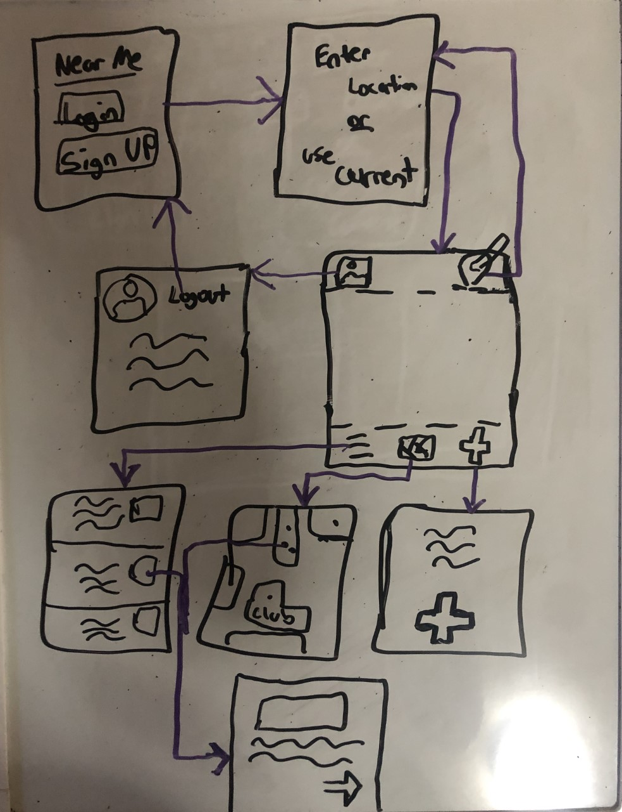

# NearMe

## Table of Contents
1. [Overview](#Overview)
1. [Product Spec](#Product-Spec)
1. [Wireframes](#Wireframes)
2. [Schema](#Schema)

## Overview
### Description
NearMe allows users to view short descriptions of events near them along with short videos from users at the events. Can be viewed on a list or map showing whats near you. Users can also post information about events currently happening, with the location, short description, and short video.

### App Evaluation
[Evaluation of your app across the following attributes]
- **Category:** Social/Video
- **Mobile:** View Only, uses camera, intended for mobile only experience
- **Story:** Allows users to find events near them and view short videos of whats currently going on.
- **Market:** Anyone looking for something to do or to go to near them could find use for this app. Can only find specific content from people you know through following. 
- **Habit:** Users can very easily check what's going on near them with a visual guide, and short stories make consumption easy since. Habit forming because users will be interested/curious on whats happening around them.
- **Scope:** Start out only focused on realtime events going on nearby. Can expand to following specific users.

## Product Spec

### 1. User Stories (Required and Optional)

**Required Must-have Stories**

- [x] User can create a new account
- [x] User can logins
- [x] User can use current location
- [x] User can view map of local posts
- [x] User can view list of local and recent posts
- [ ] User can post short info for local event w/ short desc, location, short vid
- [ ] User can set input location

**Optional Nice-to-have Stories**

- [ ] Video Support
- [ ] Profile Configuration(Pics,Desc) / User Can Remove Post
- [ ] Improve Map UI/ Group Posts Together
- [ ] User can follow/unfollow and view profiles
- [ ] User can like posts
- [ ]  Notifications for Active Area
- [ ] User can customize sorting of posts

### 2. Screen Archetypes

* Login Screen/ Registration Screen
   * User can login/create new acct
* Choose Location
    * User can choose btwn input location, or use curr location
* Profile
    * User can view and edit profile
* List View
    * User can view list of posts
* Map View
   * User can view map of posts
* Compose Post
    * User can post short info for local event w/ short desc, location, and media
* More Details
   * User can view video and description

### 3. Navigation

**Tab Navigation** (Tab to Screen)

*  Map View
*  List View
*  Compose Post
*  Profile
*  Choose Location

**Flow Navigation** (Screen to Screen)

* Login Screen/Registration
   => Where You At
* Profile Screen
   => Main Screen w/ Tab Navigation
   => Login Screen/Registraton
* Location Screen
  => Main Screen w/ Tab Navigation
* Compose Post
  => Main Screen w/ Tab Navigation
* Map/List View
  => More Details
* More Details
  => Main Screen w/ Tab Navigation

## Wireframes

## Schema 
### Models
#### Post

   | Property      | Type     | Description |
   | ------------- | -------- | ------------|
   | objectId      | String   | unique id for the user post (default field) |
   | author        | Pointer to User| post creator |
   | media         | File     | video that user posts |
   | desc          | String   | description user made |
   | location      | GeoPoint   |where user made post for |
   | createdAt     | DateTime | date when post is created (default field) |
   
 #### User

   | Property      | Type     | Description |
   | ------------- | -------- | ------------|
   | objectId      | String   | unique id for the user post (default field) |
   | username      | String   | username |
   | password      | String   | password |
   | last_location| GeoPoint   | last updated latitude |
   | createdAt     | DateTime | date when post is created (default field) |

### Networking
**List of network requests by screen**
- Login/Register Screen
    - (Create/POST) Create a new user object
    - (Read/GET) Query logged in user object
- Where You At Screen
    - (Update/PUT) Update Logged in User object w/ location
- Compose Post Screen
    - (Create/POST) Create a new post object associated w/ User
- Map/List View
    - (Read/GET) Query all posts, sorted based on time creatd
- Profile Screen
    - (Read/GET) Query logged in user object
    - (Delete) Delete previous posts

